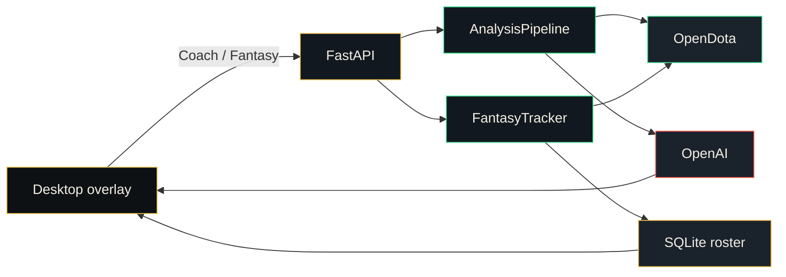

# Architecture

The overlay is a frameless pywebview window over a local FastAPI server. Docker and `serve` skip the window and expose the same UI in a browser.

## Modules

| Module | Role |
| --- | --- |
| `dota2_coach/desktop.py` | pywebview overlay, always-on-top, local server |
| `dota2_coach/fantasy/scoring.py` | OpenDota + assist fantasy formula and spans |
| `dota2_coach/fantasy/store.py` | SQLite roster and match cache |
| `dota2_coach/fantasy/tracker.py` | Add/remove players, refresh, summaries, ranked field |
| `dota2_coach/fantasy/field.py` | Ranked lobby comparison and duo detection |
| `dota2_coach/opendota/parse_jobs.py` | OpenDota parse submit helper |
| `dota2_coach/opendota/` | Match, search, profile, projected match history, parse jobs |
| `dota2_coach/opendota/parsed.py` | Latest parsed match from `version` on history rows |
| `dota2_coach/opendota/roles.py` | Lane/farm assignment from OpenDota fields |
| `dota2_coach/opendota/lanes.py` | Safelane vs offlane matchup (map side, not same `lane_role`) |
| `dota2_coach/opendota/timeline.py` | Compact teamfights and gold swing for the coach brief |
| `dota2_coach/opendota/ledger.py` | Whole game on one clock: kills, towers, Roshan, couriers, focus wards with map regions, runes, items |
| `dota2_coach/opendota/windows.py` | Objective windows (kills around each tower/Roshan), death windows (cost of each focus death), gold swings |
| `dota2_coach/opendota/phases.py` | Laning, midgame, closing summaries |
| `dota2_coach/opendota/lane_swing.py` | Gold/XP/CS gap vs the lane opponent after early kills, plus that opponent's first kill and items |
| `dota2_coach/opendota/form.py` | Recent-form summary from the player's match history |
| `dota2_coach/analysis/coverage.py` | Coverage checklist and repair pass so reports never skip deaths, lost objectives, or gold swings |
| `dota2_coach/analysis/ability_facts.py` | Curated hero mechanics injected for the ten heroes in the lobby |
| `dota2_coach/analysis/rubrics.py` | Role rubrics the grade is checked against |
| `dota2_coach/opendota/abilities.py` | Ability target names for the focus player |
| `dota2_coach/opendota/benchmarks.py` | Match percentiles and hero-curve interpolation |
| `dota2_coach/opendota/filters.py` | Ranked-only and hide-turbo fantasy filters |
| `dota2_coach/analysis/` | LLM coach |
| `dota2_coach/web/static/` | Overlay chrome, Coach tab, Fantasy tab |

This is a companion window, not an in-game Overwolf hook. It does not read the live draft. Live-client features are out of scope; see [proposals](proposals.md) for what OpenDota actually allows.
