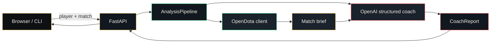

# Architecture

The 2023 prototype lived in two Tkinter scripts. The rewrite keeps a thin `main.py` and splits work by job.

## Modules

| Module | Role |
| --- | --- |
| `dota2_coach/opendota/client.py` | OpenDota HTTP: match, search, recent games |
| `dota2_coach/opendota/constants.py` | Hero, item, mode, and lobby name maps |
| `dota2_coach/opendota/normalize.py` | Compact match brief the model can actually use |
| `dota2_coach/analysis/` | Prompt, Pydantic report schema, OpenAI client |
| `dota2_coach/pipeline.py` | Fetch, normalize, coach |
| `dota2_coach/api/` | HTTP routes and app factory |
| `dota2_coach/web/static/` | Single-page UI |
| `dota2_coach/cli.py` | `serve` and `analyze` commands |

`main.py` only launches the CLI.

## Why this shape

- **Named heroes and items.** The old prompt sent `hero_id: 1`. The model now sees `Anti-Mage` and `Blink Dagger`.
- **Structured output.** `CoachReport` is parsed through the OpenAI SDK instead of stuffing free text into a Tkinter label.
- **Non-blocking web UI.** Match and model calls happen on the server; the browser stays usable.
- **Secrets in env.** `.env` / `OPENAI_API_KEY` replaces `config.ini`.
